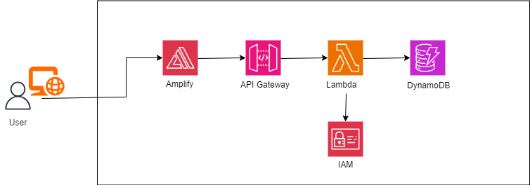
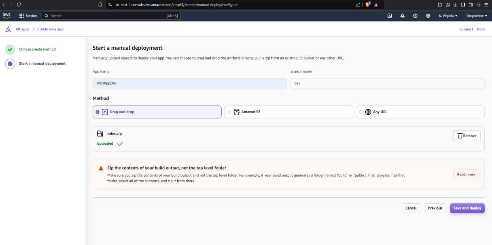
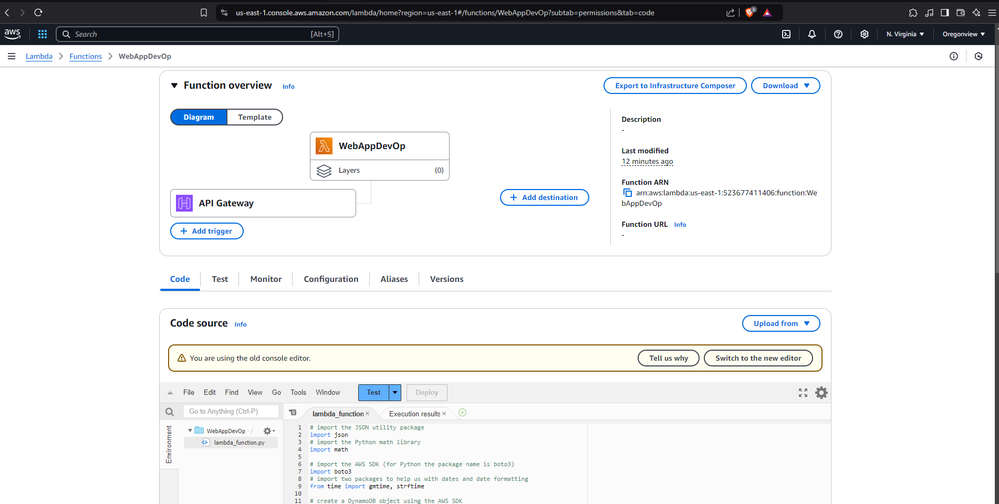
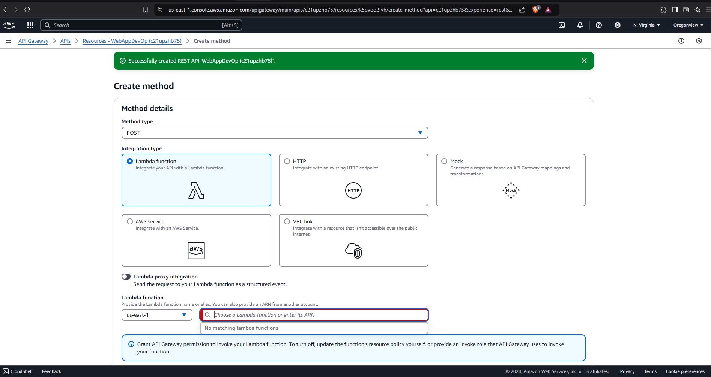
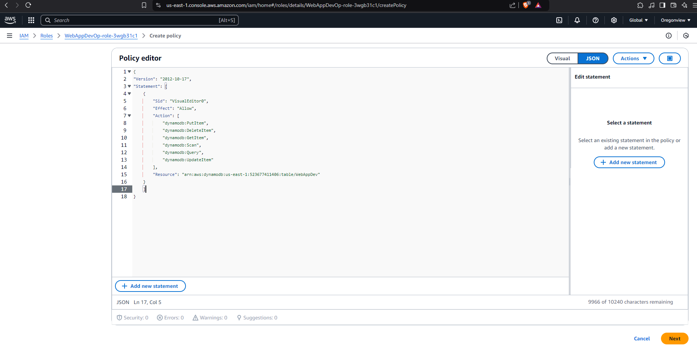
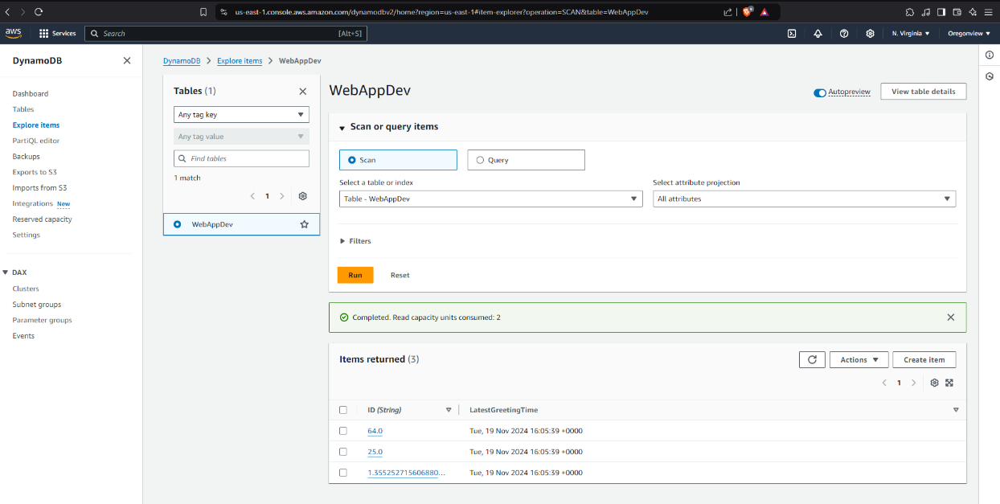
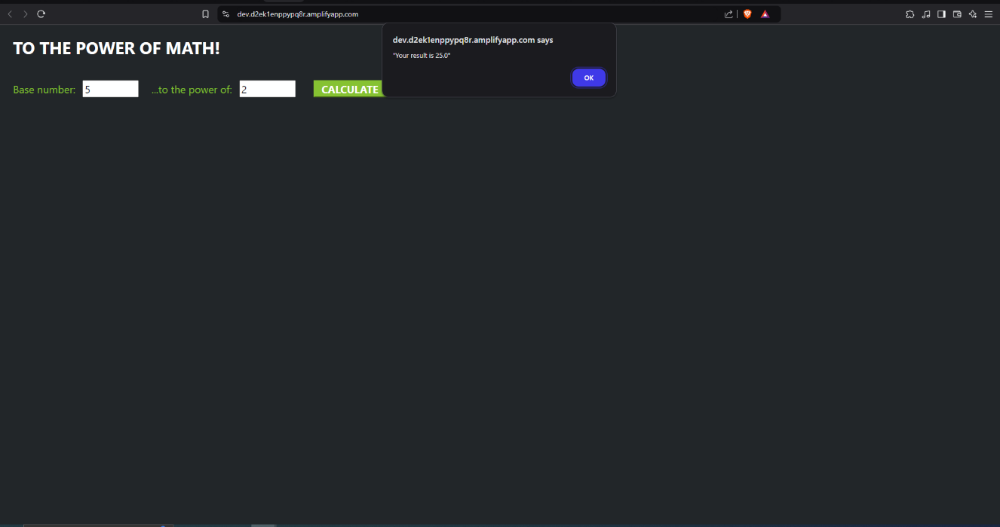

# AWS Project: Architect and Build an End-to-End AWS Web Application

## Project Overview

This project aims to create a web application using various AWS services. The application will consist of a frontend hosted on AWS Amplify and use a REST API to connect to Lambda and data storage using DynamoDB. IAM will be used to permit Lambda to have access to DynamoDB.

## Architecture

**AWS Amplify || Amazon API Gateway || AWS Lambda || AWS DynamoDB || AWS IAM**

## Key Points

- **AWS Amplify**: A development platform that simplifies building and deploying full-stack web and mobile applications. It offers seamless hosting for frontends and integrations with backend services.
- **Amazon API Gateway**: A fully managed service for creating, deploying, and managing APIs. It acts as a bridge between the front-end and back-end, with features like caching, security, and scalability.
- **AWS Lambda**: A serverless computing service that runs code in response to events without needing to manage servers. It is ideal for backend logic, processing API requests, and automating workflows.
- **AWS Identity and Access Management (IAM)**: Allows you to securely control access to AWS resources. It enables fine-grained permissions and role-based access to protect your application.
- **DynamoDB**: A fast and scalable NoSQL database designed for low-latency applications. It supports flexible schemas, on-demand capacity, and high availability.

## Implementation Steps

### Setting up AWS Amplify

1. Bundle application files into a ZIP folder.
2. Upload the ZIP file to the Amplify Console.
3. Amplify processes files, builds the application, deploys it, and generates a public URL.

### Creating Lambda Functions

1. Use AWS Lambda with Python 9 to handle user-triggered events.
2. Lambda processes user events, sends responses via the REST API, and stores data in DynamoDB.
3. Configure IAM permissions for Lambda to write to DynamoDB.

### Configuring API Gateway

1. Enable communication between services with API Gateway.
2. Use the REST API option to connect AWS Lambda functions with AWS Amplify.
3. Configure the PUT method to handle user inputs.

### Configuring IAM Roles and Policies

1. Create a custom IAM role using a JSON policy to grant permissions for Lambda to interact with DynamoDB.
2. Attach the policy to Lambda for secure access.

### Setting up DynamoDB

1. Use Amazon DynamoDB to store user-input data processed by Lambda.
2. Design the table schema for quick retrieval and seamless integration with AWS services.

## Challenges and Solutions

- **Issue**: Connection problems between the front end and API due to incorrect endpoints.
  **Solution**: Correct the API Gateway endpoint in the code.
- **Issue**: Cross-origin resource sharing (CORS) errors.
  **Solution**: Enable CORS on API Gateway to allow front-end requests.

## Conclusion

The successful execution of this project demonstrates the seamless integration and functionality of AWS services. The architecture validates the effectiveness of the design and implementation, ensuring a scalable solution for user interactions and data processing.

