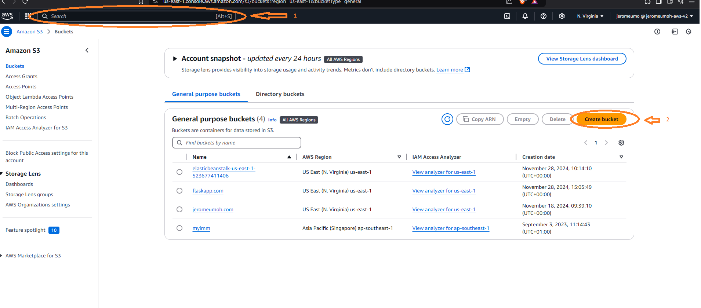
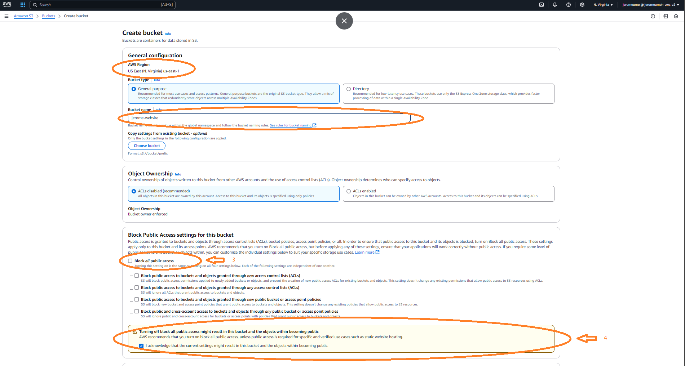
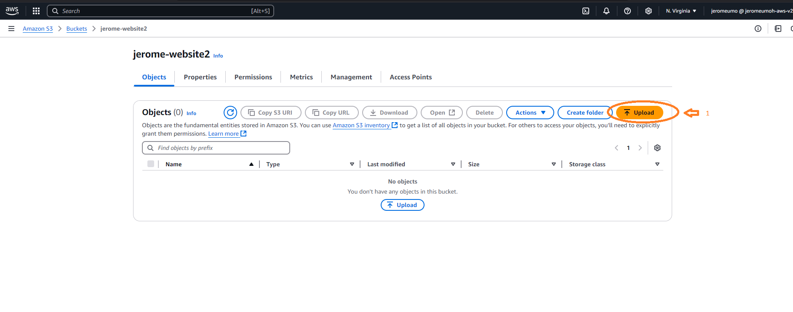
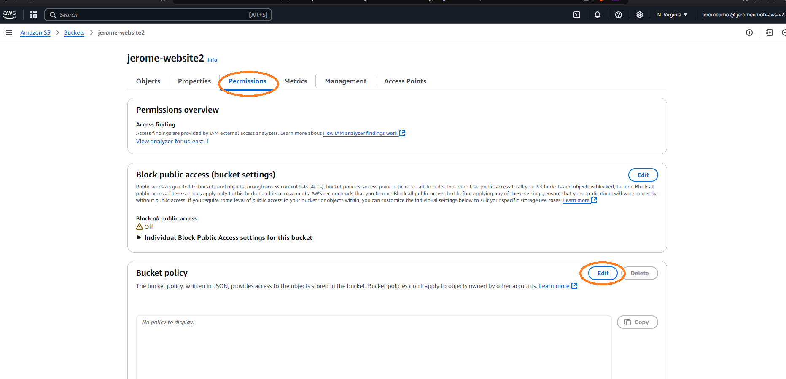
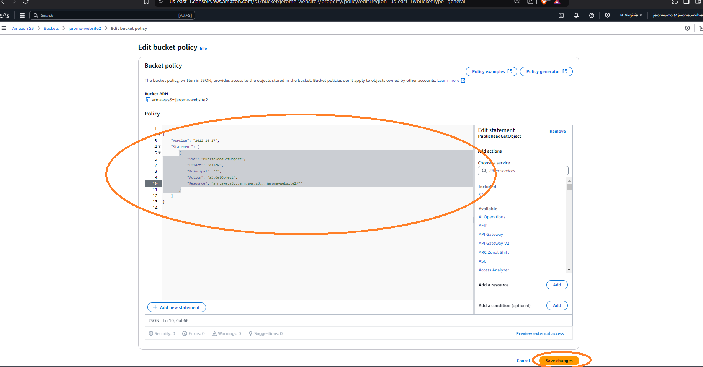
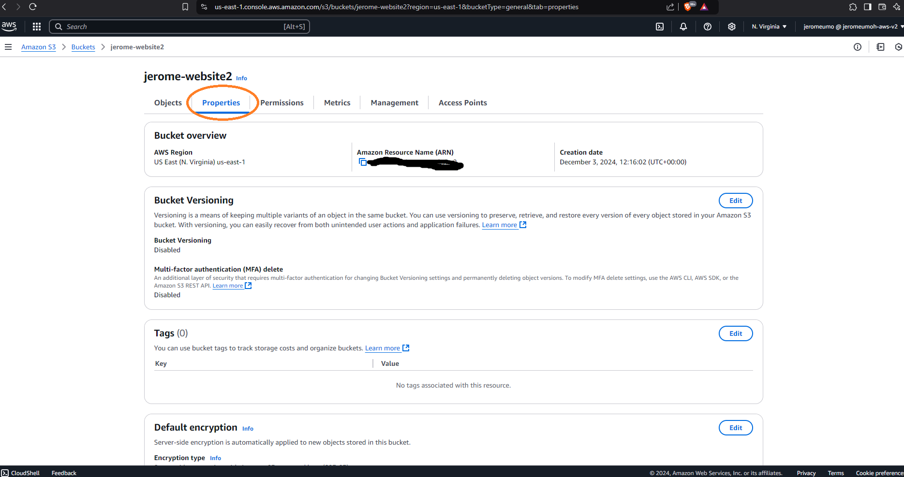
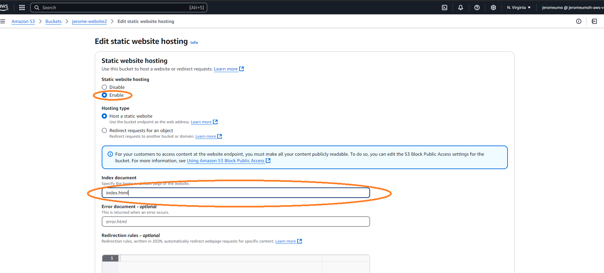
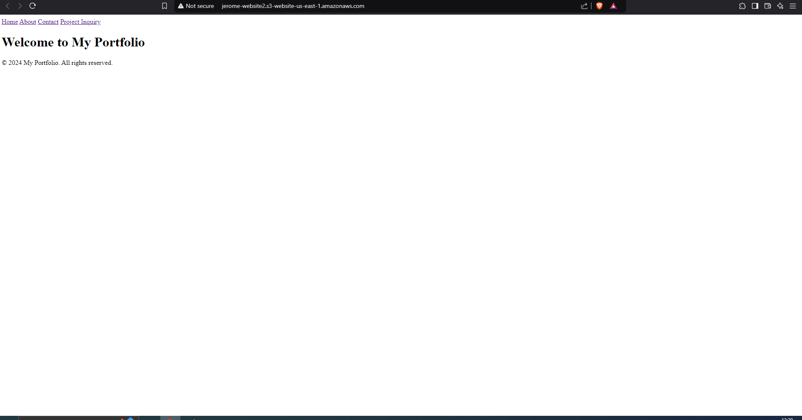

# AWS Project: Configuring S3 for Hosting and Uploading a Static Website

This project uses **AWS S3 (Simple Storage Service)** to host a static website. Amazon S3 is a robust, scalable object storage solution that allows hosting static assets like HTML and CSS files. It’s perfect for simple, lightweight websites that don’t require server-side scripting or databases.

The primary goal of this project is to:

- Set up an S3 bucket
- Upload the website files
- Configure static website hosting
- Optionally integrate it with a custom domain name via **Route 53**

---

## Project Objectives

1. Create an S3 bucket and configure it for public access
2. Upload the necessary files for the static website
3. Enable static website hosting and set up the entry point (`index.html`)
4. Access and verify the site using the S3 website endpoint

---

## Steps to Complete the Project

### Step 1: Create an S3 Bucket

1. Log into the **AWS Management Console** and navigate to the S3 service.
2. Click **Create bucket** and give it a unique name (e.g., `my-website-bucket`). Select your preferred region.



3. In the **Object Ownership** section, disable the "Block all public access" option.  
   _This step is crucial to allow public access to the website._
4. Acknowledge the warning about making the bucket public, then proceed to create the bucket.

## 

### Step 2: Upload Website Files

1. Once the bucket is created, open it and navigate to the **Upload** section.
2. Upload all your website files, including HTML, CSS, and JavaScript files.



3. Navigate to the **Permissions** tab and locate the **Bucket policy** section.



4. Paste the following JSON policy into the editor, replacing `your-bucket-name` with your actual bucket name.



```json
{
  "Version": "2012-10-17",
  "Statement": [
    {
      "Effect": "Allow",
      "Principal": "*",
      "Action": "s3:GetObject",
      "Resource": "arn:aws:s3:::your-bucket-name/*"
    }
  ]
}
```

5. Save policy

### Step 3: Enable Static Website Hosting

1. Go to the bucket's **Properties** tab and scroll down to find **Static website hosting**.
2. Click **Edit** and enable the feature.



3. Specify the **Index document** (e.g., `index.html`) and optionally an **Error document** (e.g., `404.html`).



4. Save the changes. AWS will provide an endpoint URL for your site—this is where your website will be accessible.

---

## Verify Public Access

- **Test Access**: After applying the policy, try accessing an object in the bucket using its public URL (e.g., `https://your-bucket-name.s3.amazonaws.com/index.html`).

- **Adjust Settings**: If access fails, double-check that:
  - Public access blocking is **disabled** for the bucket.
  - The **Bucket policy** is correctly configured.


