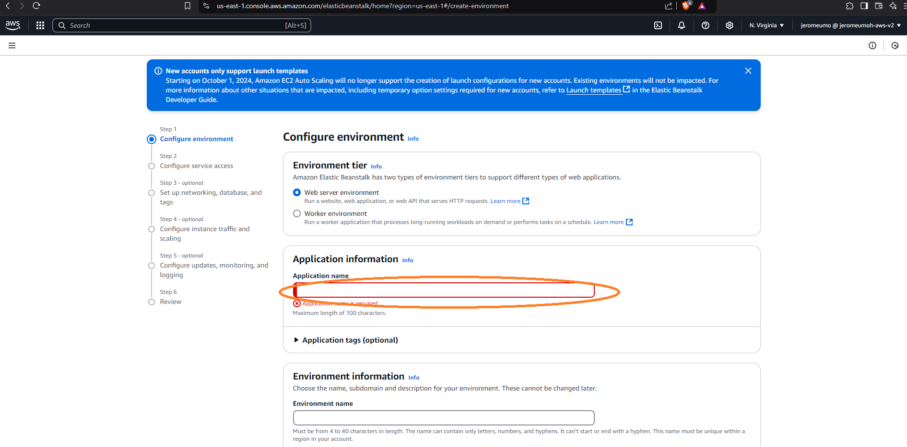
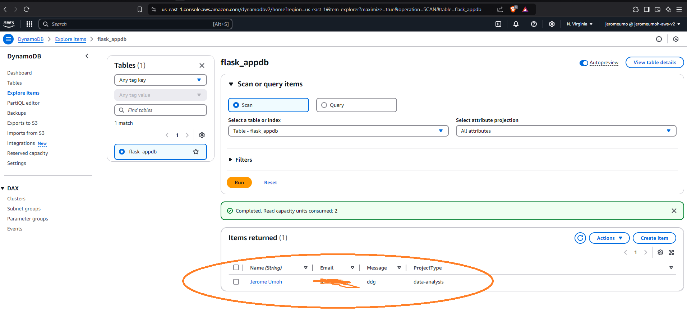

# AWS Project: Full-Stack App Deployment with AWS

## Project Overview:

This project involves building a simple full-stack web application using Flask (Python) and deploying it on AWS. The application will have a frontend hosted on Amazon S3 with CloudFront for content delivery, a backend database using DynamoDB, and the backend will be deployed using Elastic Beanstalk.

## Architecture:

AWS CloudFront || S3 || Elastic Beanstalk || AWS DynamoDB || AWS IAM


**Fig 1. Project Architecture**

---

## Brief Descriptions:

### AWS CloudFront:

AWS CloudFront is a Content Delivery Network (CDN) service that helps you distribute web content quickly and securely to users worldwide. CloudFront essentially acts like a global express delivery service for your website's content, ensuring users get the fastest possible experience no matter where they are located.

### Amazon S3:

Amazon Simple Storage Service (S3) is a cloud storage service that allows you to store and retrieve any amount of data from anywhere on the internet.

### AWS Elastic Beanstalk:

AWS Elastic Beanstalk is a fully managed service that simplifies the process of deploying and scaling web applications. It acts as a layer of automation on top of other AWS services, simplifying the deployment and management of web applications without restricting access to the underlying resources.

### AWS Identity and Access Management (IAM):

AWS Identity and Access Management (IAM) allows you to securely control access to AWS resources. It enables fine-grained permissions and role-based access to protect your application.

### DynamoDB:

DynamoDB is a fast and scalable NoSQL database designed for low-latency applications. It supports flexible schemas, on-demand capacity, and high availability.

---

## Implementation Steps:

### Amazon S3:

It was utilized in this project to host HTML, CSS, and JavaScript files for the front end, providing a cost-effective, scalable, and easily maintainable solution for serving static web content globally with built-in security features.

#### Steps:

1. Create an S3 bucket for static website hosting.
2. Upload the frontend build files to the S3 bucket.

For detailed steps and code examples on creating an S3 static website, visit my GitHub repository:  
[Cloud-Project-AWS-/StaticWebHosting-S3/s3_static_website.md at main · jeromeumo/Cloud-Project-AWS-](https://github.com/jeromeumo/Cloud-Project-AWS-/blob/main/StaticWebHosting-S3/s3_static_website.md)

---

### Amazon CloudFront:

It was utilized as a content delivery network (CDN) to enhance the performance and user experience of our web application by delivering content with low latency and high transfer speeds. CloudFront will be employed to distribute the static frontend assets (HTML, CSS, JavaScript, and images) hosted on Amazon S3.

#### Steps:

1. Log into the AWS Management Console and navigate to the CloudFront.
2. Provide the domain name of your origin, the S3 bucket (e.g., `my-bucket.s3.amazonaws.com`).
3. Select HTTP and HTTPS or HTTPS only depending on your origin configuration.
4. Review all settings and create the distribution.


**Note:** To test your hosted website on Amazon S3, use the distribution domain name on CloudFront associated with your setup.


## **Fig 2. CloudFront Configuration**

### AWS Identity and Access Management (IAM):

This service enables secure control of access to AWS resources through user roles, policies, and permissions. In this project, IAM is essential for managing permissions, ensuring the application securely interacts with AWS services like DynamoDB and Elastic Beanstalk, and enforcing least-privilege access for enhanced security.

#### Steps:

1. Navigate to IAM by searching for it in the Services menu.
2. Go to the Roles section and click **Create Role**.
3. Select Trusted Entity: Choose AWS Service.
4. Use Case: EC2.


**Fig 3. IAM Role Creation**

5. Click **Next** to proceed to permissions.
6. Attach permissions that allow the role to access the necessary AWS services, such as:

   - `AmazonDynamoDBFullAccess`: To allow read and write access to DynamoDB.
   - `AWSElasticBeanstalkWebTier`: To manage the backend deployment.
   - `AmazonS3fullAccess`: To ensure the backend can securely access or manage the frontend assets hosted on S3.


7. Click **Next** to review.
8. Provide a role name.

[IAM Role Creation](img/iiam-setup3.png)

9. Click **Create Role**.

---

### AWS Elastic Beanstalk:

This service makes it easy to deploy and manage applications without worrying about the underlying infrastructure. For this project, Elastic Beanstalk is used to handle the backend of the web application, which is built with Flask (Python). It simplifies the process by automatically setting up the necessary servers, load balancers, and scaling tools needed to run the application. Once the code is uploaded, Elastic Beanstalk takes care of the deployment, ensuring that the backend works smoothly and can handle traffic as needed.

This setup allows the backend to connect seamlessly with the frontend (hosted on S3 with CloudFront) and the database (DynamoDB), making the entire application functional and scalable.

**Fig 4. Elastic Beanstalk Deployment**  


#### Steps:

1. **Prepare Your Flask Application**

   - Ensure you have a `requirements.txt` file in your project directory. Generate it using:
     ```
     pip freeze > requirements.txt
     ```
   - Create a file called `application.py`, as AWS Elastic Beanstalk looks for this name when running a Python application, from your_flask_file import app as application.
   - Add a `.ebextensions` folder and an `options.config` file with the following:
     ```yaml
     option_settings:
       aws:autoscaling:launchconfiguration:
         RootVolumeType: gp3
     ```

2. **Create an Elastic Beanstalk Application**

   - In the AWS Management Console, search for Elastic Beanstalk and select it.
   - Click **Create a new application**.
   - Enter an application name.



- Select **Python** as the platform.


- For Application Code: Select the option to "Upload your code" and upload the application files from your local machine.


- For Configure service access, create and use a new service role.


- Click **Skip to review and create**.


---

### Amazon DynamoDB:

Amazon DynamoDB is a fully managed NoSQL database service designed for fast, scalable, and low-latency data storage. DynamoDB was used in this project because it seamlessly integrates with AWS services, supports automatic scaling to handle varying workloads, and provides high availability with minimal administrative overhead.

#### Steps:

1. Navigate to DynamoDB by searching for it in the Services menu.
2. Click **Create Table**.
3. Enter a table name.
4. Click **Create Table**.

**Note:** Make sure this table name matches your Flask app's configuration.


#### Testing the Registration Functionality/Data Storage:

# To test your work, visit the registration page, fill in the required information, and submit the form.


#Verify data in DynamoDB using the AWS Console.



---

## Challenges and Solutions:

Deploying the Flask app on Elastic Beanstalk was challenging due to a policy change by Amazon EC2 Auto Scaling. This meant that the default Elastic Beanstalk configurations relying on launch configurations were no longer valid for new accounts, resulting in deployment errors.

The issue was resolved by creating and specifying a launch template in the `options.config` file used by Elastic Beanstalk. This involved updating the configuration file to include the necessary template settings that comply with the new requirement. The updated `options.config` file was placed in the `.ebextensions` directory of the Flask application before deployment. The Amazon Elastic Beanstalk documentation provided detailed guidance on configuring the launch template.

---

## Conclusion:

In summary, this project successfully demonstrated the integration of various AWS services to create a robust full-stack web application. By leveraging Flask for the backend, DynamoDB for data storage, S3 with CloudFront for frontend hosting, and Elastic Beanstalk for deployment, we showcased the seamless interaction of these services to build a scalable and efficient solution.

The primary challenge we encountered during deployment was adapting to the new launch template requirement for recent AWS accounts. However, we effectively resolved this issue by updating the Elastic Beanstalk configuration, highlighting our ability to troubleshoot and adapt to evolving cloud infrastructure.

Overall, this project provided valuable hands-on experience in utilizing AWS tools for modern web application development. It underscored the practical benefits of cloud services in ensuring scalability, reliability, and security. The successful completion of this project not only met our technical objectives but also enhanced our understanding of cloud-based application architecture and deployment strategies.
